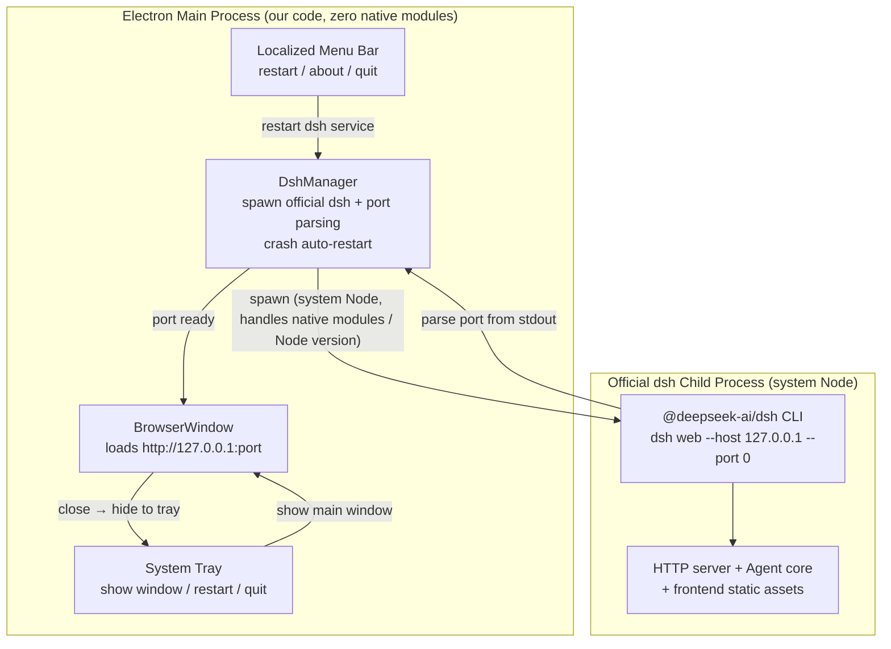

# dsh-desktop (DeepSeek Harness Desktop)

> English | [简体中文](README.md)

An Electron desktop shell built on the official npm package `@deepseek-ai/dsh`. **Approach A**:
the Electron main process spawns the official `dsh web` as a child process and loads its local
HTTP page into a window, wrapping the official WebUI into a standalone desktop application.

> Principle: **no imports, no modifications of the official dsh source** — consume only the
> official npm package and follow its `npm update` upgrades.

---

## Architecture Overview



- **The official package only exposes a CLI** — there is no importable runtime API, hence
  out-of-process `spawn`.
- **Native modules (node-pty / koffi) and the Node version requirement** are fully handled by
  the official child process running on system Node; Electron needs no `electron-rebuild`,
  so there is no ABI burden.
- **Packaged builds**: dsh and all its dependencies are unpacked to the real filesystem via
  `asarUnpack`, and the main process launches the child using an **absolute system Node path +
  `dsh/lib/bin.js`** (see "How packaged builds locate system Node").
- If the official project later ships an embed/SDK, we can evolve to Approach B
  (file:// + IPC bridge) without touching the frontend code.

---

## Requirements

| Dependency | Version | Notes |
|------------|---------|-------|
| System Node.js | `^22.19.0 \|\| >=24.0.0` | dsh official requirement, used by the child process |
| npm | bundled with Node | for installing dependencies |
| Electron | `^43.0.0` (dev) | window & display only |

> Note: Electron's bundled Node version does not satisfy dsh's requirement — **but that is
> fine**, because dsh runs in a separate system Node child process and Electron only displays
> the page.

### How packaged builds locate the Node runtime

**Since v0.2.0 the app bundles a slim Node runtime** (`resources/node-runtime/`), so packaged
builds work **without the user installing Node**. The resolution order:

1. **Bundled Node runtime** (packaged builds, preferred) — `resources/node-runtime/node.exe`
   (Windows) or `bin/node` (macOS)
2. **Explicit `nodePath` in `config.json`** (for customization) — e.g. on macOS:
   ```json
   { "nodePath": "/usr/local/bin/node" }
   ```
3. Auto-detect (nvm → Homebrew → official paths), with **version validation for every
   candidate** (dsh requires `^22.19 || >=24`); outdated versions (e.g. system v18) are skipped

> The bundled Node is produced by `scripts/fetch-node.cjs` (slimming the official dist in
> `node/` into `vendor/`) and packaged via `extraResources` in `electron-builder.yml`.
> Dev mode (`npm run dev`) has no bundled dir and falls back to steps 2/3.

> Packaged builds also require dsh and all its dependencies to be unpacked via `asarUnpack`
> (`electron-builder.yml` sets `**/node_modules/**`), because the system/bundled Node cannot
> read files inside the asar archive.

---

## Installation & Running

```bash
# Enter the project directory
cd electron-app

# Install dependencies (installs official @deepseek-ai/dsh and Electron)
npm install

# Dev mode: compile TypeScript first, then launch Electron
npm run dev

# Or in two steps
npm run build   # compile src -> dist
npm start       # launch electron .
```

On first launch:
1. The main process `spawn`s the official `dsh web --host 127.0.0.1 --port 0`;
2. It parses the actual port from the child's stdout (OS-assigned to avoid conflicts);
3. It creates a window loading `http://127.0.0.1:<port>` — you see the official WebUI.

### Installing unsigned macOS builds

The current release is **not signed/notarized with an Apple Developer ID**, so macOS
Gatekeeper may block the first install/launch. Common errors and their fixes:

| Error message | Cause | Fix |
|---------------|-------|-----|
| "cannot be opened because the developer cannot be verified" / "Apple cannot check it for malicious software" | Gatekeeper blocks the unsigned app | **Right-click the app icon → select "Open" → click "Open" again in the dialog** (first time only; double-click works afterwards) |
| "is damaged and can't be opened. You should move it to the Trash" | Download carries a quarantine flag | Run `xattr -dr com.apple.quarantine "/Applications/DeepSeek Harness 桌面端.app"` in Terminal |
| "cannot be opened because it is from an unidentified developer" | Same as above | System Settings → Privacy & Security → click "Open Anyway" |

> Each fix is needed **only once**; the app itself is unaffected — this only bypasses
> the Gatekeeper check. If prompts persist, check System Settings → Privacy & Security →
> Security and make sure "Allow applications from" is not locked to
> "App Store and identified developers" only.

---

## Configuration

### API Key

Environment variable injection is recommended (most secure, no file writes):

```bash
export DEEPSEEK_API_KEY="your-key"
npm run dev
```

Or create a `config.json` at the project root (gitignored, **never commit it**):

```json
{
  "apiKey": "your-key",
  "host": "127.0.0.1",
  "port": 0,
  "extraArgs": []
}
```

Precedence: **environment variable > config.json > built-in default**.

### Other Options

- `host`: listen address, default `127.0.0.1` (loopback only, not exposed).
- `port`: `0` lets the OS assign a free port; you may fix one (e.g. `3080`).
- `extraArgs`: extra CLI arguments passed through to `dsh web` verbatim.
- `nodePath`: absolute path to the system Node.js (required for packaged builds — see
  "How packaged builds locate system Node").

### Where config.json is read

The desktop app looks up `config.json` in order; **the first found is used, not merged**:

| Scenario | Path |
|----------|------|
| Dev mode (`npm run dev`) | project root: `electron-app/config.json` |
| **Packaged Windows** | `%APPDATA%\dsh-desktop\config.json`, i.e. `C:\Users\<user>\AppData\Roaming\dsh-desktop\config.json` |
| **Packaged macOS** | `~/Library/Application Support/dsh-desktop/config.json` |

> The directory name comes from Electron's `app.getName()` (the `name` field of
> `package.json`, i.e. `dsh-desktop`, when packaged; note it is NOT `productName`
> "DeepSeek Harness 桌面端" — that value only lives in electron-builder.yml and does
> not reach the packaged app.asar's package.json). A missing file is silently ignored,
> falling back to defaults/environment variables.

---

## Project Structure

```
electron-app/
├── package.json          # deps & scripts (official @deepseek-ai/dsh, electron-builder)
├── tsconfig.json         # TypeScript config (CommonJS output to dist/)
├── electron-builder.yml  # packaging config (npmRebuild:false + asarUnpack native modules)
├── .npmrc                # CN mirrors (npmmirror + Electron binary mirror)
├── .gitignore
├── README.md             # Chinese (primary)
├── README.en.md          # English
├── scripts/
│   ├── build-native.cjs    # pre-pack: materialize koffi native binary (best-effort)
│   ├── generate-icon.cjs   # icon generation: official SVG → build/icon.ico / icon.png (needs sharp)
│   ├── publish-lib.mjs     # publish common module: artifact scan, version parse, release notes
│   └── publish-github.mjs  # publish script: gh CLI creates GitHub Release & uploads artifacts
└── src/
    ├── main/             # main process code (Node)
    │   ├── index.ts          # entry: lifecycle, IPC, menu/tray wiring, error fallback
    │   ├── dsh-process.ts    # core: DshManager (spawn + port retry + crash auto-restart)
    │   ├── window.ts         # BrowserWindow, close→tray interception, error page, reload by port
    │   ├── menu.ts           # localized menu (File/Edit/View/Window/Help + restart/about/quit)
    │   ├── tray.ts           # system tray (show/restart/quit; persistent entry after close)
    │   ├── config.ts         # config loading & dsh env assembly
    │   └── log.ts            # unified logging
    └── preload/          # preload script (reserved desktop bridge for Approach A)
        └── index.ts          # exposes window.dshDesktop (platform/version/open external/retry)
```

---

## Robustness Design

The desktop app is fault-tolerant across "startup" and "survival" to avoid white screens or
silent crashes:

| Scenario | Behavior |
|----------|----------|
| **Port conflict retry** | If a fixed port is configured and occupied, retry with the next port (up to 10 times). Default `--port 0` is OS-assigned, no conflicts. |
| **Child crash auto-restart** | On abnormal exit, restart with exponential backoff (1s→2s→4s…), up to 5 times; the window seamlessly refreshes to the new port. |
| **Load failure fallback** | On timeout or `did-fail-load` (e.g. dsh crash), render a localized error page with a "Reconnect" button that restarts dsh. |
| **Startup failure** | If the first launch fails with no window, show a dialog and quit; with a window, show the error page instead of a white screen. |
| **Close → system tray** | Clicking the window X (or Cmd+W) does not quit; the app hides to the system tray. Restore via tray menu "Show main window" / tray double-click. If the tray is unavailable (some Linux desktops), closing quits directly to avoid losing the window. |
| **Explicit quit** | "Quit" in tray or menu ends the app; on exit the whole process tree is `tree-kill`ed so grandchild processes spawned by dsh are cleaned up. |

> Restart/retry entries: menu "File → Restart dsh Service", the error page "Reconnect"
> button, and macOS Dock rebuild.
> Window restore entries: tray menu/double-click, macOS Dock activation, and second-instance focus.

---

## Packaging & Native Module Distribution

Production distribution uses `electron-builder`. The core challenge is shipping native
modules (node-pty / koffi) correctly; our principle is "do not let Electron rebuild, only
unpack":

1. **`npmRebuild: false`** (key)
   Native modules are loaded by the dsh child process running on **system Node**; never let
   `electron-rebuild` compile them against Electron's bundled Node ABI, or the child process
   crashes on load. See `electron-builder.yml`.
2. **`asarUnpack` native directories**
   Node cannot load `.node` / `.dll` / `.exe` from inside the asar archive, so
   `node_modules/node-pty/**`, `node_modules/koffi/**`, etc. must be unpacked to the real
   filesystem (the current config unpacks all of `node_modules/**`).
3. **`build:native` materializes the koffi binary**
   koffi ships no prebuilt binary in its npm package (it downloads at runtime). 
   `scripts/build-native.cjs` materializes it into `node_modules/koffi/win32_x64/koffi.node`
   before packaging so the first run does not depend on the network. **Failure does not block
   packaging** (runtime can still self-download).

### Build Commands

```bash
# Unpacked directory for dev/debug (verify structure)
npm run pack

# Windows installer (NSIS .exe)
npm run build:electron:win

# macOS dual-arch (produces x64 + arm64)
npm run build:electron:mac

# Other platforms / custom args: passed through to electron-builder
npm run build:electron -- --linux
```

> `build:electron` is the main command (`build:native` → `tsc` → `electron-builder`);
> platform args are passed via `--`: Windows uses `--win`, macOS dual-arch uses
> `--mac --x64 --arm64`.

Artifacts are output to `dist-electron/` (gitignored).

### Publish to GitHub Release

```bash
# 1. Build first (produces installer & latest.yml under dist-electron/)
npm run build:electron:win

# 2. Publish (create/update GitHub Release and upload all artifacts)
npm run release:github
```

- **Prerequisite**: install & login to the `gh` CLI (`winget install --id GitHub.cli && gh auth login`).
- **Tag**: taken from `package.json` `version` → `v{version}` (e.g. `v0.1.0`).
- **Release notes**: default text; create `RELEASE_NOTES.md` at the project root to customize
  (full Markdown becomes the Release Notes).
- **Re-publishing the same version**: the script detects the existing release, updates notes,
  and `--clobber`-overwrites same-named assets.
- **Artifact scope**: all top-level `.exe / .dmg / .AppImage / .deb / .zip / .yml / .blockmap`
  under `dist-electron/` (excluding `builder-*` debug files).

### Notes

- **Custom icon**: the official Harness black-whale icon is auto-generated by
  `scripts/generate-icon.cjs` into `build/icon.ico` (multi-size) and `build/icon.png` —
  no manual maintenance.
- **CN mirrors**: `.npmrc` configures npmmirror and the Electron binary mirror, so Electron
  downloads are not affected.
- **First package takes time**: `npm install` downloads Electron and dsh's native
  dependencies; using the CN mirror is recommended.
- **dev-preview risk**: `@deepseek-ai/dsh` is in rc; upgrades may bring breaking changes —
  pin the version and regression-test after upgrading (the port-parsing regex depends on its
  stdout format).

---

## Known Limitations & Roadmap

- **Not a final architecture**: the official webserver comments already reserve a
  `file:// + IPC` desktop form. Once an official embed/SDK ships, the transport layer can
  switch from HTTP to IPC without touching frontend code.
- **Port**: currently communicates over loopback HTTP; any local process could reach the
  port. Approach B can remove this surface.
- **dev-preview risk**: `@deepseek-ai/dsh` is in rc; upgrades may bring breaking changes —
  pin the version and regression-test after upgrading (the port-parsing regex depends on its
  stdout format).
