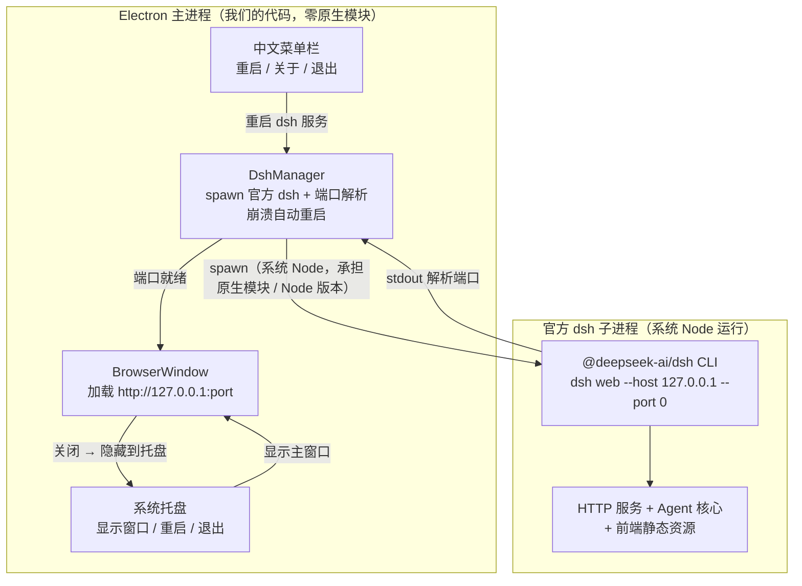

# dsh-desktop（DeepSeek Harness 桌面端）

> **简体中文** | [English](README.en.md)

基于官方 npm 包 `@deepseek-ai/dsh` 的 Electron 桌面壳。**方案 A** 的核心思路：
Electron 主进程通过子进程启动官方 `dsh web`，再把其本地 HTTP 页面加载进窗口，
从而把官方 WebUI 包装成一个独立桌面应用。

> 原则：**不引用、不改动官方 dsh 任何源码**，仅消费官方 npm 包，跟随其 `npm update` 升级。

---

## 架构概览



- **官方主包只暴露 CLI**，没有可 import 的运行时 API，因此采用进程外 `spawn`。
- **原生模块（node-pty / koffi）与 Node 版本要求**全部由系统 Node 跑的官方子进程承担，
  Electron 侧无需 `electron-rebuild`，无 ABI 负担。
- **打包版**：dsh 及其全部依赖由 `asarUnpack` 解包到真实文件系统，主进程用
  「系统 Node 绝对路径 + `dsh/lib/bin.js`」启动子进程（见「打包版如何找到系统 Node」）。
- 后续若官方发布 embed/SDK，可演进到方案 B（file:// + IPC 桥接），前端代码无需改动。

---

## 环境要求

| 依赖 | 版本要求 | 说明 |
|------|----------|------|
| 系统 Node.js | `^22.19.0 \|\| >=24.0.0` | dsh 官方的硬性要求，由子进程使用 |
| npm | 随 Node 自带 | 用于安装依赖 |
| Electron | `^43.0.0`（开发依赖） | 仅负责窗口与显示 |

> 注意：Electron 内置的 Node 版本不满足 dsh 要求，**但无所谓**——
> dsh 跑在独立的系统 Node 子进程里，Electron 只负责显示页面。

### 打包版如何找到系统 Node

打包后的 .app / .exe 从 Finder / 桌面双击启动时，进程的 `PATH` **不包含**用户 shell
（`~/.zshrc` 等）里配置的路径，因此无法靠 `npx`/`node` 命令找到系统 Node。
桌面端按以下顺序解析系统 Node 绝对路径：

1. **config.json 显式配置 `nodePath`**（最可靠，推荐）——例如 macOS：
   ```json
   { "nodePath": "/usr/local/bin/node" }
   ```
   （Apple Silicon + Homebrew 通常是 `/opt/homebrew/bin/node`）
2. 常见安装路径自动探测：macOS `/opt/homebrew/bin/node` → `/usr/local/bin/node` → `/usr/bin/node`；
   Windows `C:\Program Files\nodejs\node.exe` 等

> 若探测失败且未配置，启动会报错提示。打包版同时要求 dsh 及其全部依赖
> 被 `asarUnpack` 解包（`electron-builder.yml` 已配置 `**/node_modules/**`），
> 因为系统 Node 无法读取 asar 压缩包内的文件。

---

## 安装与运行

```bash
# 进入项目目录
cd electron-app

# 安装依赖（会同时装上官方 @deepseek-ai/dsh 与 Electron）
npm install

# 开发模式：先编译 TypeScript，再启动 Electron
npm run dev

# 或分两步
npm run build   # 编译 src -> dist
npm start       # 启动 electron .
```

首次启动会：
1. 主进程 `spawn` 官方 `dsh web --host 127.0.0.1 --port 0`；
2. 从子进程 stdout 解析实际端口（系统自动分配，避免冲突）；
3. 创建窗口加载 `http://127.0.0.1:<port>`，看到的就是官方 WebUI。

---

## 配置

### API Key
推荐用环境变量注入（最安全，不写入文件）：

```bash
export DEEPSEEK_API_KEY="你的密钥"
npm run dev
```

或在项目根创建 `config.json`（已被 `.gitignore` 忽略，**切勿提交**）：

```json
{
  "apiKey": "你的密钥",
  "host": "127.0.0.1",
  "port": 0,
  "extraArgs": []
}
```

配置优先级：**环境变量 > config.json > 内置默认**。

### 其他参数
- `host`：监听地址，默认 `127.0.0.1`（仅本机，不暴露网络）。
- `port`：传 `0` 让系统分配空闲端口；也可固定（如 `3080`）。
- `extraArgs`：需要原样透传给 `dsh web` 的额外命令行参数数组。
- `nodePath`：系统 Node.js 绝对路径（打包版必须，见下文「打包版如何找到系统 Node」）。

### config.json 的读取位置

桌面端按顺序查找 `config.json`，**找到即用、不合并**：

| 场景 | 路径 |
|------|------|
| 开发模式（`npm run dev`） | 项目根：`electron-app/config.json` |
| **打包版 Windows** | `%APPDATA%\DeepSeek Harness 桌面端\config.json`，即 `C:\Users\<用户名>\AppData\Roaming\DeepSeek Harness 桌面端\config.json` |
| **打包版 macOS** | `~/Library/Application Support/DeepSeek Harness 桌面端/config.json` |

> 目录名取 Electron 的 `app.getName()`（打包后为 `productName`），文件不存在时忽略，全部走默认值/环境变量。

---

## 目录结构

```
electron-app/
├── package.json          # 依赖与脚本（含官方 @deepseek-ai/dsh、electron-builder）
├── tsconfig.json         # TypeScript 配置（CommonJS 输出到 dist/）
├── electron-builder.yml  # 打包配置（重点：npmRebuild:false + asarUnpack 原生模块）
├── .npmrc                # 国内镜像源（npmmirror + Electron 二进制镜像）
├── .gitignore
├── README.md
├── scripts/
│   ├── build-native.cjs    # 打包前置：物化 koffi 原生二进制（best-effort）
│   ├── generate-icon.cjs   # 图标生成：官方 SVG → build/icon.ico / icon.png（依赖 sharp）
│   ├── publish-lib.mjs     # 发布公共模块：产物扫描、版本解析、发布说明加载
│   └── publish-github.mjs  # 发版脚本：gh CLI 创建 GitHub Release 并上传产物
└── src/
    ├── main/             # 主进程代码（Node）
    │   ├── index.ts          # 入口：生命周期、IPC、菜单/托盘串联、错误兜底
    │   ├── dsh-process.ts    # 核心：DshManager（spawn + 端口冲突重试 + 崩溃自动重启）
    │   ├── window.ts         # 创建 BrowserWindow、关闭→托盘拦截、加载失败兜底错误页、按端口重加载
    │   ├── menu.ts           # 中文应用菜单（文件/编辑/视图/窗口/帮助 + 重启/关于/退出）
    │   ├── tray.ts           # 系统托盘（显示窗口/重启 dsh/退出，关闭窗口后常驻入口）
    │   ├── config.ts         # 配置读取与 dsh 环境变量组装
    │   └── log.ts            # 统一日志工具
    └── preload/          # 预加载脚本（方案 A 预留桌面集成接口）
        └── index.ts          # 暴露 window.dshDesktop（平台/版本/打开外部链接/重试）
```

---

## 健壮性设计

桌面端在「启动」与「存活」两个维度做了容错，避免白屏或静默崩溃：

| 场景 | 行为 |
|------|------|
| **端口冲突重试** | 若显式配置了固定端口且该端口被占用，自动顺延端口重试（最多 10 次）后再失败。默认 `--port 0` 由系统分配，不会冲突。 |
| **子进程崩溃自动重启** | dsh 子进程运行期间异常退出时，按指数退避（1s→2s→4s…）自动重启，最多 5 次；重启成功后窗口无缝刷新到新端口。 |
| **加载失败兜底** | 页面加载超时或 `did-fail-load`（如 dsh 崩溃）时，渲染中文错误页，提供「重新连接」按钮，点击即重启 dsh。 |
| **启动彻底失败** | 首次启动即失败且无窗口时，弹窗提示后退出；有窗口时展示错误页，而非白屏。 |
| **关闭 → 系统托盘** | 点窗口右上角 X（或 Cmd+W）不退出应用，隐藏到系统托盘常驻；托盘菜单「显示主窗口」/双击托盘图标恢复。托盘不可用（个别 Linux 桌面）时关闭窗口直接退出，避免窗口丢失。 |
| **主动退出** | 托盘或菜单「退出」显式结束应用；退出时按进程树 `tree-kill`，dsh 拉起的孙进程一并清理。 |

> 重试/重启入口有三处：菜单「文件 → 重启 dsh 服务」、错误页「重新连接」按钮、macOS Dock 重建。
> 窗口恢复入口有三处：托盘菜单/双击、macOS Dock 激活、二次启动实例聚焦。

---

## 打包与原生模块分发

生产分发使用 `electron-builder`。核心难点是**原生模块（node-pty / koffi）随包正确分发**，
我们的处理原则是「不让 Electron 重编译、只负责解包」：

1. **`npmRebuild: false`**（关键）
   原生模块由**系统 Node** 运行的 dsh 子进程加载，绝不能让 `electron-rebuild` 把它们
   编译成 Electron 内置 Node 的 ABI，否则子进程一加载就崩。配置见 `electron-builder.yml`。
2. **`asarUnpack` 解包原生目录**
   Node 无法从 asar 压缩包内加载 `.node` / `.dll` / `.exe`，必须把
   `node_modules/node-pty/**`、`node_modules/koffi/**` 等解包到真实文件系统。
3. **`build:native` 物化 koffi 二进制**
   koffi 不在 npm 包内附带预编译二进制（运行时自下载到临时目录）。`scripts/build-native.cjs`
   在打包前主动把它物化进 `node_modules/koffi/win32_x64/koffi.node`，随包分发，
   避免打包后首次运行依赖联网。**该步骤失败不阻断打包**（运行时仍可自下载）。

### 打包命令

```bash
# 开发调试用的免安装目录（验证打包结构）
npm run pack

# Windows 安装包（NSIS .exe）
npm run build:electron:win

# macOS 双架构（同时产出 x64 + arm64）
npm run build:electron:mac

# 其他平台 / 自定义参数：透传给 electron-builder
npm run build:electron -- --linux
```

> `build:electron` 是主命令（`build:native` → `tsc` → `electron-builder`），
> 平台参数通过 `--` 透传：Windows 用 `--win`，macOS 双架构用 `--mac --x64 --arm64`。

产物输出到 `dist-electron/`（已在 `.gitignore` 忽略）。

### 发布到 GitHub Release

```bash
# 1. 先打包（产出 dist-electron/ 下的安装包与 latest.yml）
npm run build:electron:win

# 2. 发布（创建/更新 GitHub Release 并上传全部产物）
npm run release:github
```

- **前置**：安装并登录 `gh` CLI（`winget install --id GitHub.cli && gh auth login`）。
- **tag**：自动取 `package.json` 的 `version`，生成 `v{version}`（如 `v0.1.0`）。
- **发布说明**：默认文案；在项目根创建 `RELEASE_NOTES.md` 即可自定义（Markdown 全文作为 Release Notes）。
- **重复发布同版本**：脚本检测到已存在的 release 时会更新说明并 `--clobber` 覆盖同名附件。
- **产物范围**：`dist-electron/` 顶层所有 `.exe / .dmg / .AppImage / .deb / .zip / .yml / .blockmap`（排除 `builder-*` 调试文件）。

### 注意事项

- **自定义图标**：官方 Harness 黑色鲸鱼图标已由 `scripts/generate-icon.cjs` 自动生成到
  `build/icon.ico`（多尺寸）与 `build/icon.png`，无需手工维护。
- **国内镜像**：`.npmrc` 已配置 npmmirror 与 Electron 二进制镜像，Electron 下载不受影响。
- **首次打包耗时**：`npm install` 会下载 Electron 与官方 dsh 的原生依赖，建议使用国内源。
- **dev-preview 风险**：`@deepseek-ai/dsh` 处于 rc 阶段，版本升级可能带来破坏性变更，
  建议锁定版本并在升级后回归测试（端口解析正则依赖其 stdout 格式）。

---

## 已知限制与后续演进

- **此方案不是终态**：官方 webserver 注释已预留 `file:// + IPC` 的桌面形态。
  待官方发布正式的 embed/SDK 后，可将传输层从 HTTP 替换为 IPC，前端代码无需改动。
- **端口**：当前通过 loopback HTTP 通信，本机任意进程都能访问该端口。方案 B 可消除此面。
- **dev-preview 风险**：`@deepseek-ai/dsh` 处于 rc 阶段，版本升级可能带来破坏性变更，
  建议锁定版本并在升级后回归测试（端口解析正则依赖其 stdout 格式）。
